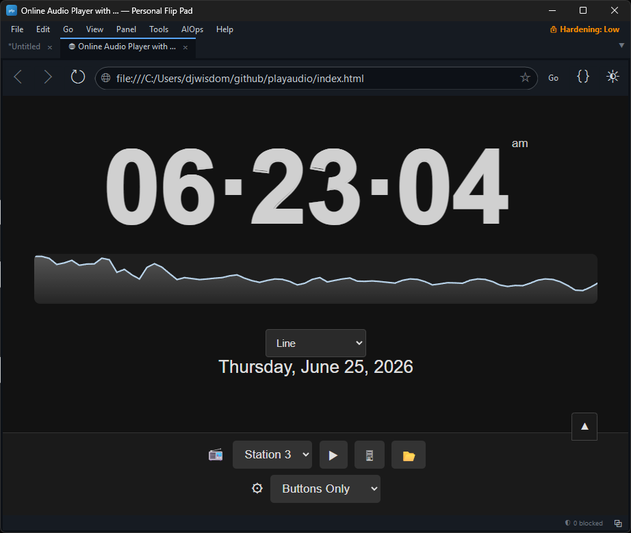

<p align="center">
  
</p>

# PlayAudio

A minimal, self-contained web application built with vanilla HTML, CSS, and JavaScript. It combines a real-time clock and date display with a multi-source audio player and a real-time graphic equalizer.

---

## Features

### Main Display (Centered)
- **Digital Clock** — 12-hour format with AM/PM, smooth dynamic resizing via JS `ResizeObserver`. Bounded between 48px and 400px. Formula: `clamp(48px, measured-to-fit, 400px)`. Never overflows viewport width; respects left/right margins (`5vw` each side).
- **AM/PM Indicator** — sits as an inline superscript at the top-right of the clock digits, sized comparably to the date text.
- **Date Display** — localized, full-length date string updated every minute.
- **Graphic Equalizer** — 14 selectable real-time visualization modes rendered on `<canvas>` below the clock.

### Audio Sources (Statusbar — Bottom Panel)
The statusbar contains all playback controls and supports three audio source modes:

1. **Radio Station** (`📻`) — Select from 6 preset internet radio streams.
2. **Capture Tab/Window Audio** (`🖥`) — Uses `navigator.mediaDevices.getDisplayMedia({ audio: true })` to capture audio from any browser tab or window (e.g., YouTube). The captured stream is routed through a Web Audio `AnalyserNode` for visualization, but **not** connected to the page's audio output, so the source tab's native audio remains clean and unprocessed.
3. **Open Local File** (`📂`) — Accepts any audio file via a file picker (`<input type="file" accept="audio/*">`).

### Playback Control Modes (Player Mode Dropdown)
A `⚙` selector in the statusbar lets the user choose between three player interface styles:

- **Native Player** — Browser-default `<audio controls>` with built-in transport.
- **Custom Player** — Minimal inline controls: play/pause button, seek bar, current/total time display, volume slider, and speed selector.
- **Buttons Only** — No visible player widget at all. Playback is controlled entirely via the statusbar buttons (Play, Capture, Open Local File, Speed).

### Playback Speed
A speed dropdown (`⏱`) in every mode supports `0.5x`, `0.75x`, `1x`, `1.25x`, `1.5x`, and `2x` via `HTMLMediaElement.playbackRate`.

### Statusbar Toggle
A `▲/▼` button (top-right of the statusbar) collapses and expands the entire bottom control panel. When collapsed, only the toggle button remains visible, giving an unobstructed view of the clock and equalizer.

### Equalizer Visualization Modes
All modes use the same `AnalyserNode` data source. The rendering function switches behavior based on the selected `<select id="renderMode">`.

#### Frequency-Domain Modes (`getByteFrequencyData`)
| Mode | Description |
|---|---|
| `bars` | Classic vertical frequency bars with rounded caps and simulated fallback when no analyser data is present. |
| `gradientBars` | Vertical bars with a per-bar `LinearGradient` transitioning from bright at the top to dark at the base. |
| `mirrorBars` | Bars grow both upward and downward from a horizontal center line. Top half is opaque; bottom half is semi-transparent for depth. |
| `peakBars` | Vertical bars plus a slowly-decaying white "cap" marker above each, showing recent peak amplitude. |
| `dotMatrix` | A grid of circular dots whose radius and opacity map to frequency intensity, resembling an LED matrix. |
| `line` | Filled area chart with a bright stroked line on top; smooth simulated baseline when no audio is active. |
| `area` | Filled polygon under a stepped curve, with a stroked upper edge. |
| `bezier` | Smooth quadratic Bézier curve connecting sampled points, with a soft filled area beneath. |

#### Time-Domain Modes (`getByteTimeDomainData`)
| Mode | Description |
|---|---|
| `waveform` | Classic oscilloscope trace of raw PCM samples centered vertically. |
| `circularWave` | Frequency data mapped to radial distance from center, drawn as a closed circular shape. |
| `filledBand` | Time-domain waveform with a semi-transparent filled area underneath for a "ribbon" effect. |

#### Hybrid / Advanced Modes
| Mode | Description |
|---|---|
| `waterfall` | Scrolling 2D heatmap (spectrogram) where each new frequency frame is appended at the bottom and older rows scroll upward. |
| `terrain` | Stacked line plots with perspective-like fading — each row represents a time slice, creating a 3D wireframe landscape effect. |
| `particles` | Particle emitter system driven by aggregate audio energy. Particles spawn from the bottom with velocity and hue influenced by frequency intensity. |

All modes include animated fallback motion when no real analyser data is available (e.g., before Play is clicked), so the equalizer never appears static or broken.

---

## Files

| File | Purpose |
|---|---|
| `index.html` | Single-page markup, all CSS styles, and DOM structure. |
| `script.js` | Clock logic, ResizeObserver sizing, `<audio>` playback, `getDisplayMedia` capture, Web Audio graph (`AudioContext`, `AnalyserNode`, `MediaElementSource`, `MediaStreamSource`), 14 rendering functions, and statusbar toggling. |
| `README.md` | This document. |
| `.gitignore` | Ignores `node_modules`, `.env`, and other standard artifacts. |

No build step, no package manager, no external dependencies.

---

## Browser Compatibility

| Feature | Chrome | Edge | Firefox | Safari |
|---|---|---|---|---|
| Native `<audio controls>` | ✅ | ✅ | ✅ | ✅ |
| `getDisplayMedia` tab audio capture | ✅ | ✅ | ⚠️ Limited | ❌ Not supported |
| Web Audio API (`AudioContext`, `AnalyserNode`) | ✅ | ✅ | ✅ | ✅ |
| `MediaElementSource` on blob URLs | ✅ | ✅ | ✅ | ✅ |
| `canvas.roundRect` | ✅ | ✅ | ✅ | ✅ (Safari 15.4+) |
| `requestAnimationFrame` | ✅ | ✅ | ✅ | ✅ |

- **Radio** and **Local File** modes work in all modern browsers.
- **Capture Tab/Window Audio** requires a Chromium-based browser (Chrome, Edge, Opera). Firefox and Safari do not expose system audio in `getDisplayMedia`.
- Bluetooth/USB audio devices are handled by the OS; the browser routes the captured stream through the normal audio pipeline.

---

## How the Audio Graph Works

### Radio / Local File Playback
```
HTMLAudioElement → MediaElementSource → AnalyserNode → AudioContext.destination (speakers)
```

### Tab/Window Capture (YouTube, etc.)
```
getDisplayMedia stream → MediaStreamSource → AnalyserNode   (no connection to destination)
```
The analyser receives frequency data from the captured stream while the page produces zero output from that path. The original tab's audio plays through the OS mixer independently, avoiding echo or reverb.

### Switching Between Sources
- `crossOrigin = "anonymous"` is set before loading remote streams (required for `MediaElementSource` CORS).
- `crossOrigin = null` is set before loading local blob URLs (CORS would break blob playback).
- The original error, in which the equalizer showed no movement for local files, was caused by `crossorigin="anonymous"` being left on the element. That is now corrected.

---

## Architecture Notes

### Clock Sizing
The clock uses a JS-driven measurement loop rather than pure CSS `clamp()` or `vw` units:
1. Temporarily set `fontSize` to 100px.
2. Measure `scrollWidth` of the rendered text.
3. Compute the ratio of available container width to text width.
4. Apply the ratio, clamped between 48px and 400px.
5. Re-run on `window.resize` and via `ResizeObserver` on the `.timeoneliner` container.

This ensures the clock:
- Fills the available horizontal space.
- Never overflows its container.
- Never drops below a legible size.
- Responds smoothly (0.4s CSS transition) to window changes.

### Equalizer Canvas
- The canvas is sized to `width: 100%` of `.timeoneliner`, so it always matches the clock's horizontal span.
- `devicePixelRatio` is accounted for to avoid blurriness on HiDPI/Retina displays.
- All 14 modes share a single `requestAnimationFrame` loop; switching modes resets transient state (particle arrays, peak-hold values, waterfall history) to avoid stale visuals.

---

## Controls Summary

| Control | Location | Action |
|---|---|---|
| `📻` + dropdown | Statusbar row 1 | Choose radio station |
| `▶` button | Statusbar row 1 | Play selected station |
| `🖥` button | Statusbar row 1 | Activate browser tab/window audio picker |
| `📂` button | Statusbar row 1 | Open local audio file picker |
| `⚙` + dropdown | Statusbar row 2 | Switch native/custom/no player |
| `⏱` + dropdown | Statusbar row 2 | Set playback speed (0.5x–2x) |
| `<audio>` / Custom sliders | Statusbar row 2 | Transport and volume (mode-dependent) |
| `▲/▼` button | Statusbar top-right | Collapse/expand statusbar |

---

## Running the Project

**Do not double-click `index.html` to open it.** Browsers treat `file://` pages as a restricted security origin. Features like tab/window audio capture (`getDisplayMedia`), Web Audio `MediaElementSource` with CORS, and some canvas/audio APIs will fail or throw errors such as:

```
Unsafe attempt to load URL index.html from frame with URL index.html.
'file:' URLs are treated as unique security origins.
```

Always serve the folder over HTTP instead:

1. Clone or open the repository folder.
2. Serve it with any static HTTP server (no build step or dependency installation required).

Example with Python:
```bash
cd C:\Users\casse\source\repos\playaudio
python -m http.server 8080
# Open http://localhost:8080
```

Example with Node.js:
```bash
npx serve .
```

---

## Known Limitations

- **Do not open `index.html` via `file://`.** The app requires an HTTP server (`http://localhost` or any static host). Opening the file directly from disk will break tab/window audio capture, equalizer visualization for radio/local sources, and trigger cross-origin errors.
- **Tab/Window audio capture** (`getDisplayMedia`) is limited to Chromium-based browsers. Firefox and Safari do not expose system audio in this API.
- The **Stereo Field** visualization mode from the original concept was excluded because internet radio streams and `getDisplayMedia` captures are typically mono, making left/right channel splitting meaningless.
- Some internet radio streams may intermittently change their CORS policy. If `createMediaElementSource` fails, the equalizer falls back to animated simulated bars, and audio still plays through the `<audio>` element's native output.
- The **local file equalizer issue** was resolved by clearing `crossOrigin = null` before loading blob URLs and properly managing the one-time `createMediaElementSource` binding.

---

*This project is intentionally kept as a single-file-style web app with no framework and no build pipeline.*
